<!DOCTYPE html>
<html lang="en">
<head>
    <meta charset="UTF-8">
    <meta name="viewport" content="width=device-width, initial-scale=1.0">
    <title>DJ Aye Jaye - Future Levels | Producer | Mobile DJ | Artist</title>
    
</head>
<body>
    <!-- Navigation -->
    <nav>
        

            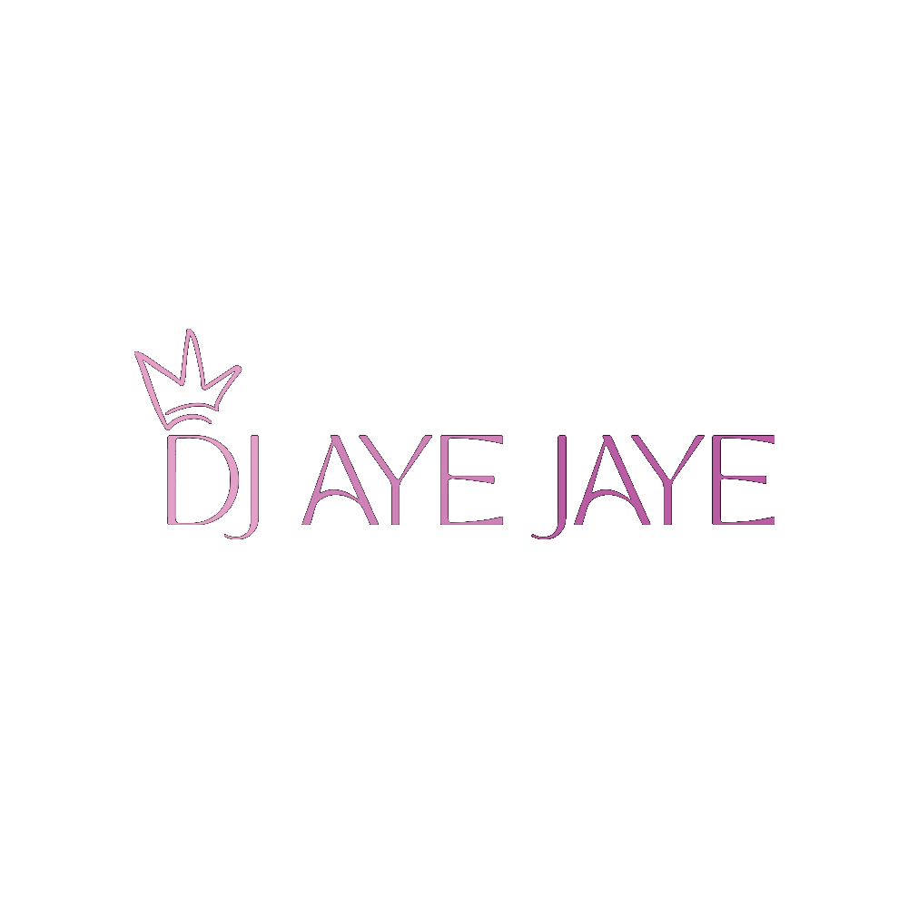
        

        <ul class="nav-links">
            <li><a href="#home">Home</a></li>
            <li><a href="#services">Services</a></li>
            <li><a href="#gallery">Gallery</a></li>
            <li><a href="#music">Music</a></li>
            <li><a href="#about">About</a></li>
            <li><a href="#contact">Book Now</a></li>
        </ul>
        

            
            
            
        

    </nav>

    <!-- Hero Section -->
    <section id="home" class="hero">
        

        

            
            <h2>Producer | Mobile DJ | Touring Artist</h2>
            

                16-year-old nationally traveling DJ bringing next-level energy to every stage. 
                From major sports events to intimate celebrations, delivering unforgettable experiences 
                through music and production excellence.
            

            

                <a href="#contact" class="btn">Book an Event</a>
                <a href="#music" class="btn btn-secondary">Listen to Music</a>
            

        

    </section>

    <!-- Stats Section -->
    <section class="stats-section">
        

            

                
150+

                
Events Performed

            

            

                
50+

                
Cities Traveled

            

            

                
1000+

                
Happy Clients

            

            

                
6+

                
Years Experience

            

        

    </section>

    <!-- Services Section -->
    <section id="services">
        <h2 class="section-title">Services</h2>
        

            

                <h3>🎬 Future Levels Productions</h3>
                

                    Full-service event production for corporate events, conferences, and large-scale gatherings. 
                    Professional sound, lighting, and technical production to elevate your event to the next level.
                

                <ul>
                    <li>Corporate Events & Conferences</li>
                    <li>Sports Events & Halftime Shows</li>
                    <li>Festival Production</li>
                    <li>Professional Sound & Lighting</li>
                    <li>Complete Technical Setup</li>
                </ul>
            

            

                <h3>🎧 Mobile DJ Services</h3>
                

                    Professional DJ services for weddings, private parties, school events, and special celebrations. 
                    Custom music curation and MC services to keep your guests entertained all night long.
                

                <ul>
                    <li>Weddings & Receptions</li>
                    <li>Private Parties & Celebrations</li>
                    <li>School Dances & Youth Events</li>
                    <li>Birthday Celebrations</li>
                    <li>Community Events</li>
                </ul>
            

            

                <h3>🎵 Artist & Live Performer</h3>
                

                    Original music production and high-energy live performances. Nationally traveling artist 
                    bringing unique sound and infectious energy to clubs, festivals, and special events nationwide.
                

                <ul>
                    <li>Club & Venue Performances</li>
                    <li>Festival Sets & Tours</li>
                    <li>Original Music Production</li>
                    <li>Touring Artist Bookings</li>
                    <li>Special Event Headliner</li>
                </ul>
            

        

    </section>

    <!-- Gallery Section -->
    <section id="gallery" style="background: var(--gray);">
        <h2 class="section-title">Performance Gallery</h2>
        

            

                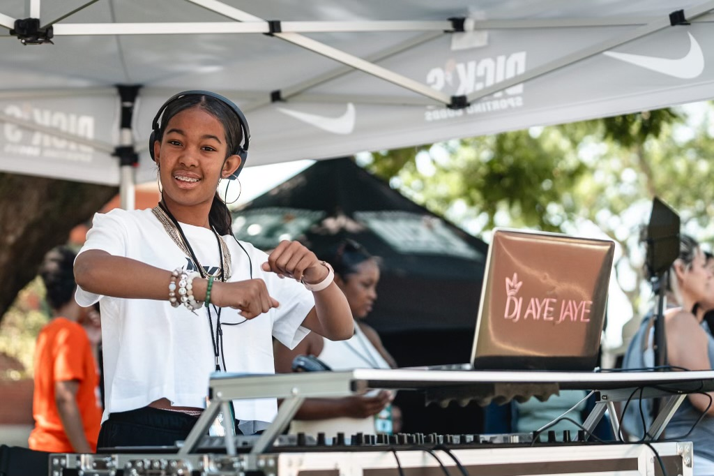
            

            

                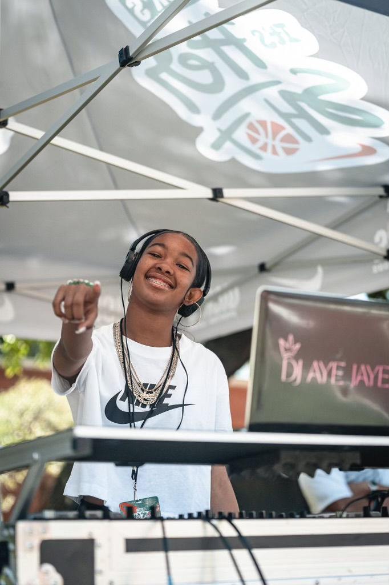
            

            

                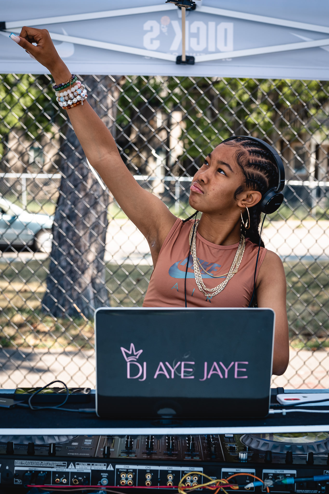
            

            

                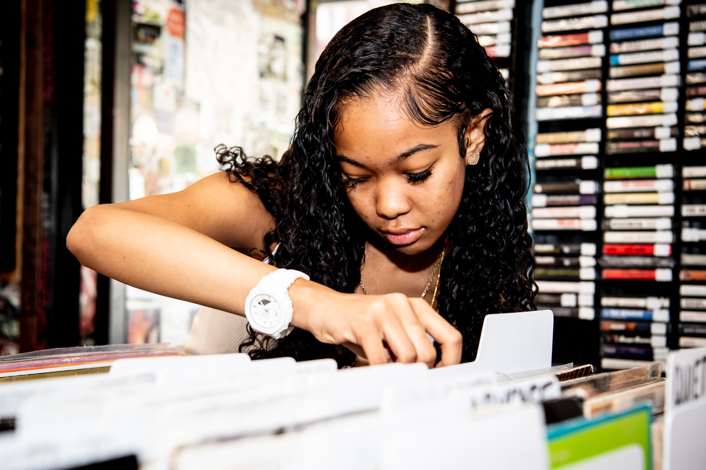
            

            

                
            

            

                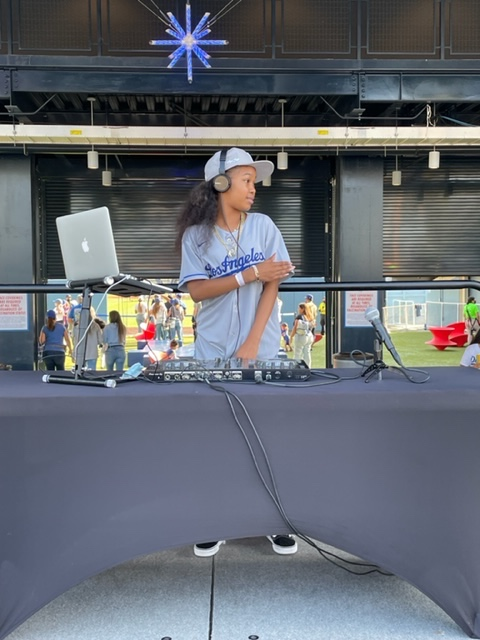
            

            

                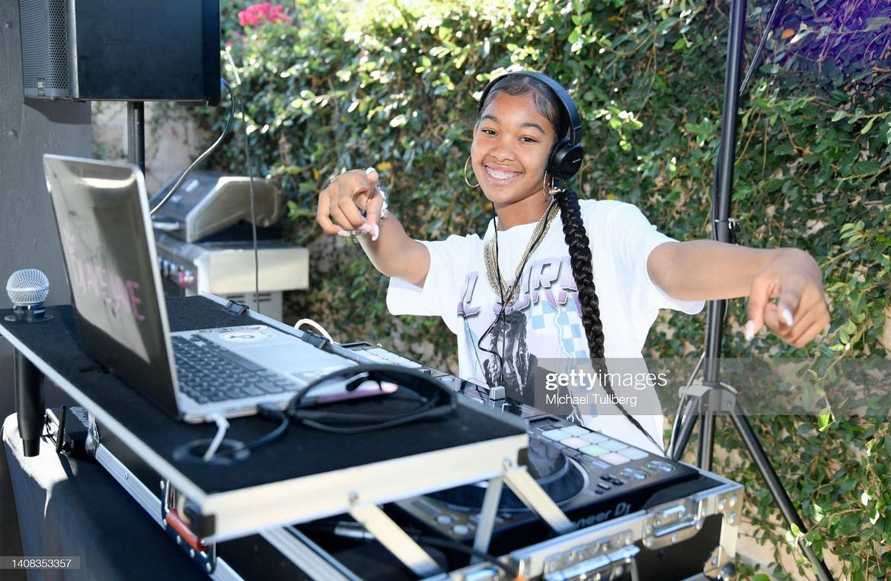
            

            

                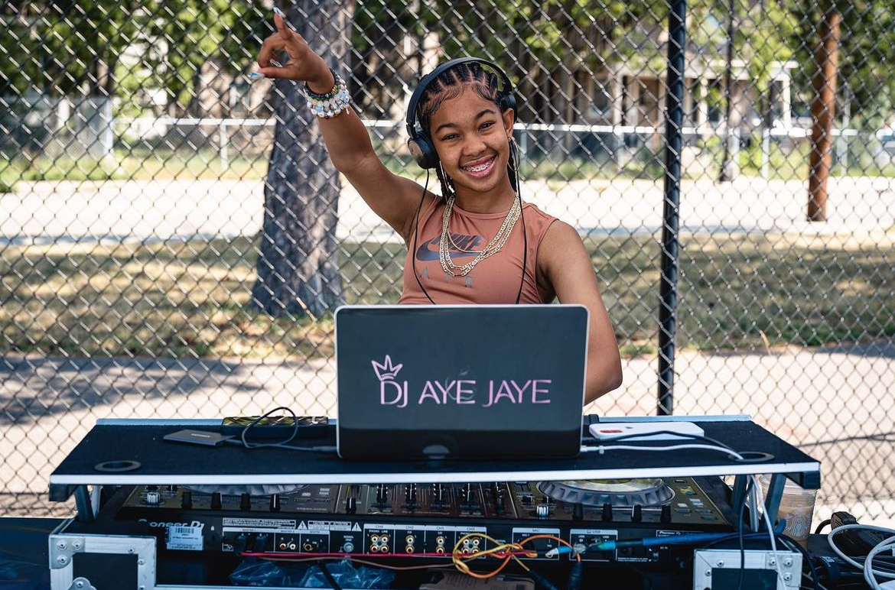
            

            

                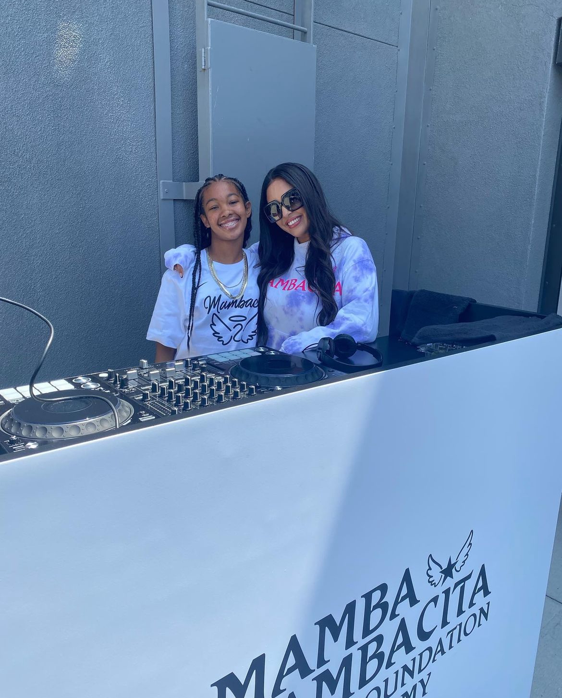
            

            

                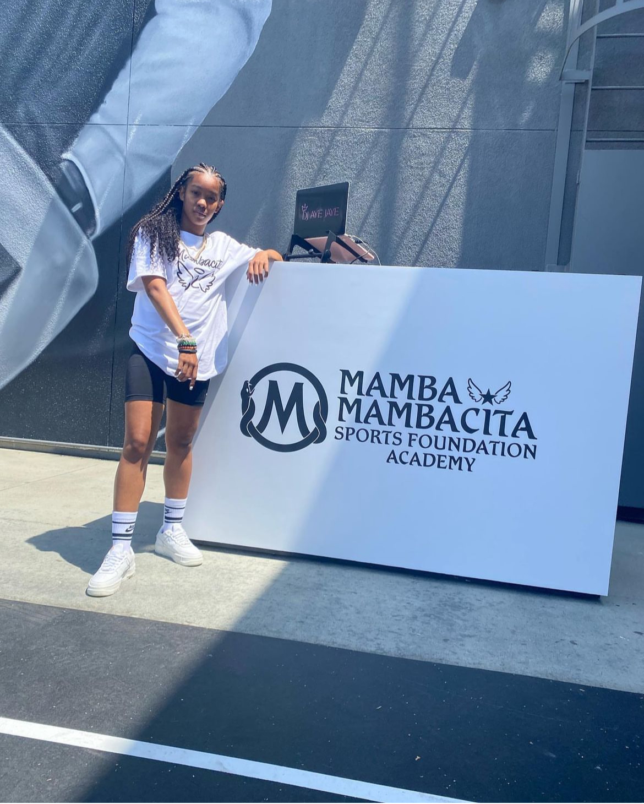
            

            

                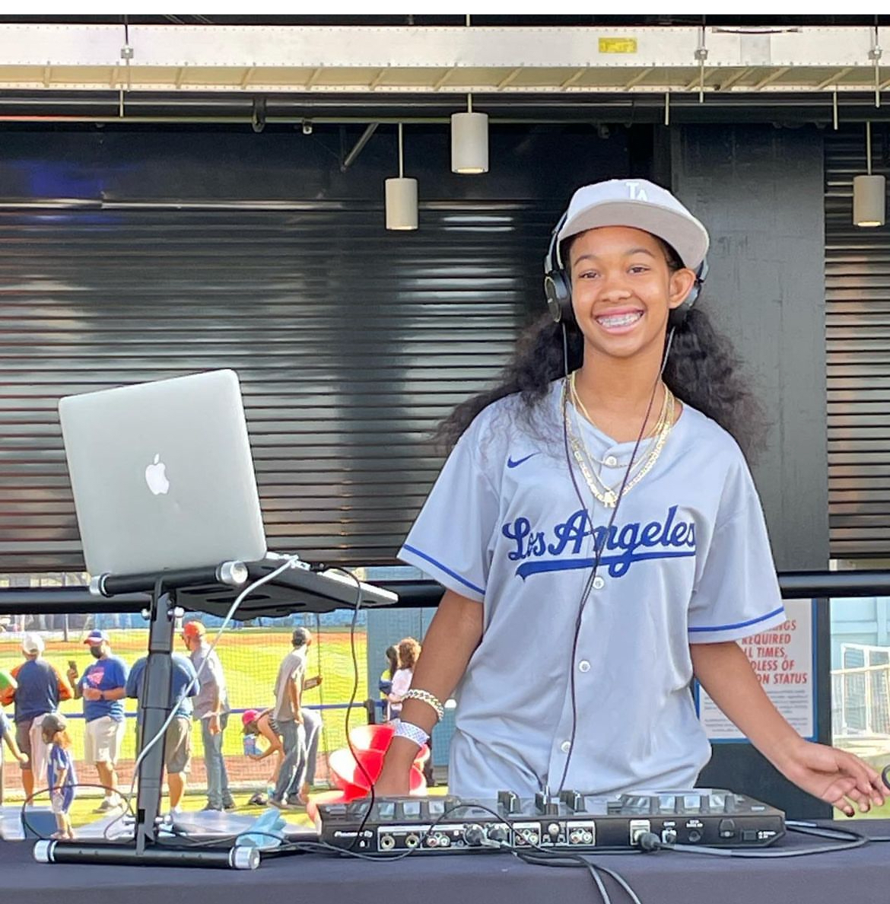
            

            

                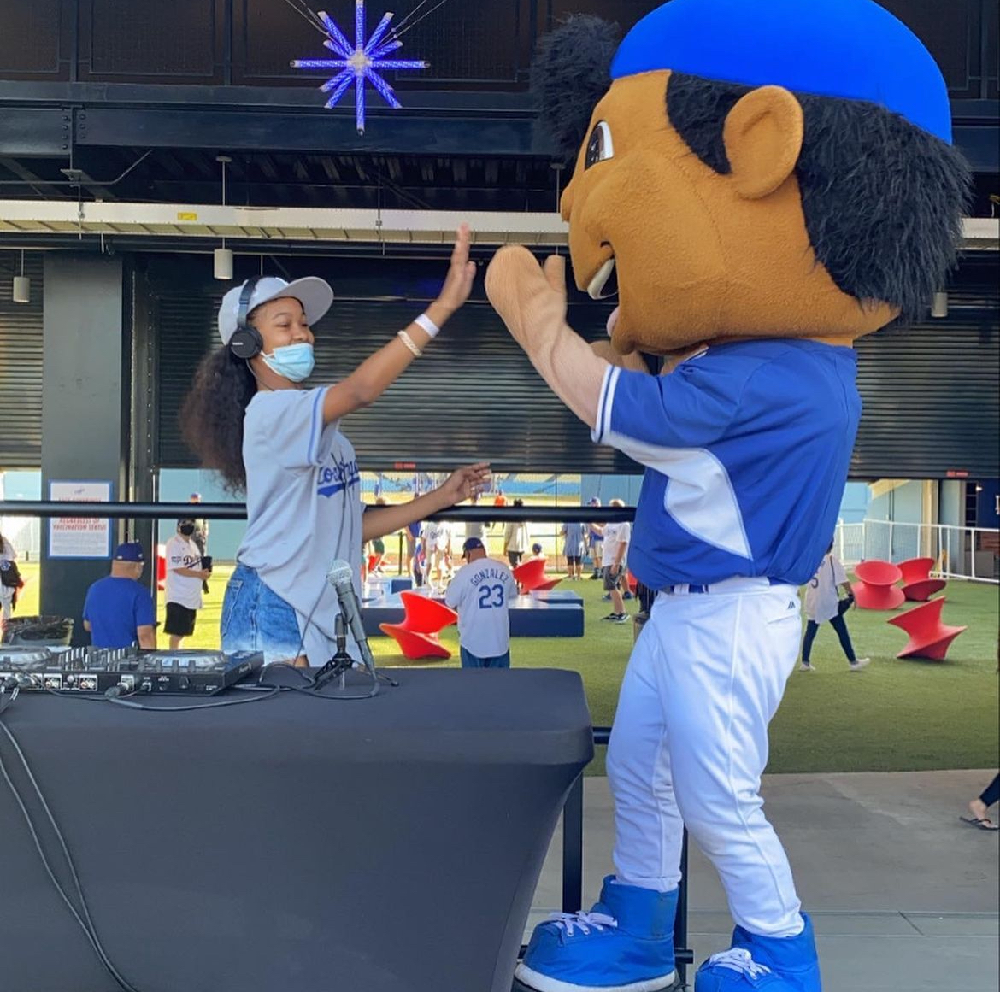
            

            

                
            

            

                
            

            

                
            

            

                
            

        

    </section>

    <!-- Music Section -->
    <section id="music">
        <h2 class="section-title">Music & Releases</h2>
        

            <h3>Coming Soon - New Releases</h3>
            <ul class="track-list">
                <li class="track-item">
                    

                        
▶

                        

                            
Summer Vibes (Original Mix)

                            
Coming Soon 2026

                        

                    

                    
3:45

                </li>
                <li class="track-item">
                    

                        
▶

                        

                            
Night Drive Remix

                            
Coming Soon 2026

                        

                    

                    
4:12

                </li>
                <li class="track-item">
                    

                        
▶

                        

                            
Festival Anthem 2026

                            
Coming Soon 2026

                        

                    

                    
3:28

                </li>
                <li class="track-item">
                    

                        
▶

                        

                            
Future Levels (Signature Track)

                            
Coming Soon 2026

                        

                    

                    
3:55

                </li>
            </ul>
            

                🎵 New original music dropping soon! Follow on social media for exclusive previews and release updates.
            

        

    </section>

    <!-- About Section -->
    <section id="about" style="background: var(--gray);">
        <h2 class="section-title">About DJ Aye Jaye</h2>
        

            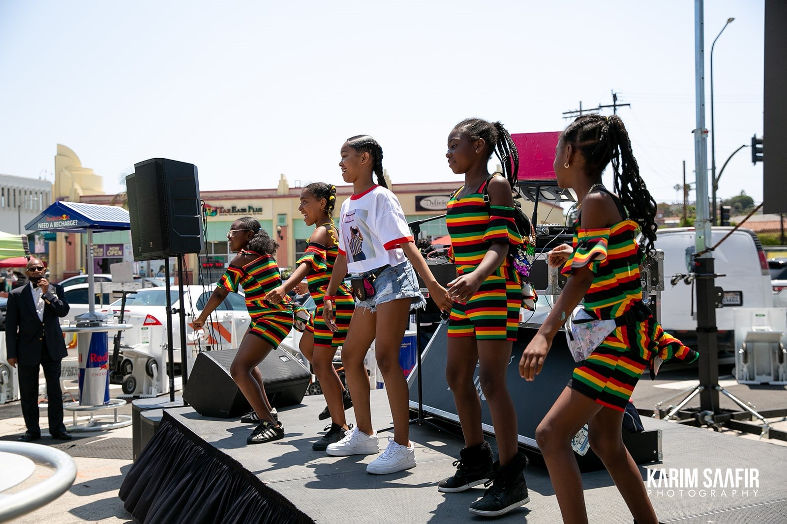
            <h3>Future Levels</h3>
            

                At just 16 years old, DJ Aye Jaye has already traveled across the nation, bringing passion, 
                energy, and professionalism to every performance. What started as a love for music and mixing 
                has evolved into Future Levels - a complete production company and mobile DJ service that 
                delivers exceptional experiences.
            

            

                From performing at major sporting events like Mamba Mambacita Foundation events to weddings, 
                school dances, and community celebrations, DJ Aye Jaye specializes in reading the crowd and 
                creating unforgettable moments. With professional equipment, technical expertise, and an 
                infectious love for music, every event gets the Future Levels treatment.
            

            

                Currently working on original music releases to share a unique sound with the world. Whether 
                it's a corporate production, intimate wedding, or high-energy festival set, DJ Aye Jaye brings 
                the same dedication, professionalism, and passion to every performance. The future is here, 
                and it's time to take your event to the next level.
            

        

    </section>

    <!-- Contact Section -->
    <section id="contact">
        <h2 class="section-title">Book Your Event</h2>
        <form class="contact-form fade-in">
            

                <label for="name">Name *</label>
                <input type="text" id="name" required>
            

            

                <label for="email">Email *</label>
                <input type="email" id="email" required>
            

            

                <label for="phone">Phone Number</label>
                <input type="tel" id="phone">
            

            

                <label for="service">Service Type *</label>
                <select id="service" required>
                    <option value="">Select a service...</option>
                    <option value="production">Future Levels Production</option>
                    <option value="mobile">Mobile DJ Service</option>
                    <option value="artist">Artist Performance</option>
                    <option value="wedding">Wedding DJ</option>
                    <option value="corporate">Corporate Event</option>
                    <option value="other">Other</option>
                </select>
            

            

                <label for="date">Event Date</label>
                <input type="date" id="date">
            

            

                <label for="message">Event Details & Special Requests *</label>
                <textarea id="message" required placeholder="Tell us about your event, expected attendance, venue details, and any special requests..."></textarea>
            

            <button type="submit" class="btn" style="width: 100%;">Send Booking Inquiry</button>
        </form>
    </section>

    <!-- Footer -->
    <footer>
        
        

            <a href="#" title="Instagram">📷</a>
            <a href="#" title="TikTok">🎵</a>
            <a href="#" title="YouTube">📺</a>
            <a href="#" title="SoundCloud">🔊</a>
            <a href="#" title="Spotify">🎧</a>
        

        

            <strong>DJ AYE JAYE | FUTURE LEVELS</strong>
        

        

            Professional DJ Services | Production Company | Touring Artist
        

        

            © 2026 DJ Aye Jaye / Future Levels. All rights reserved.
        

    </footer>

    
</body>
</html>djayejaye-website-V1
